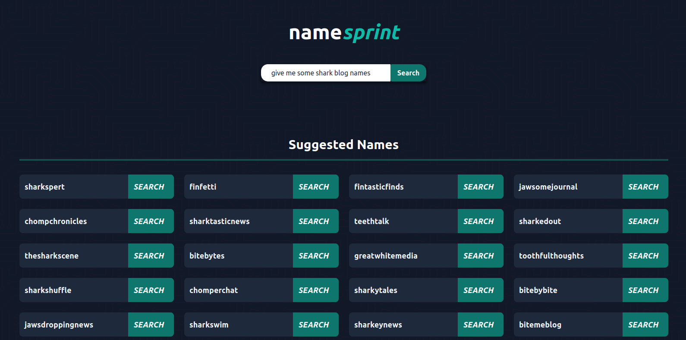
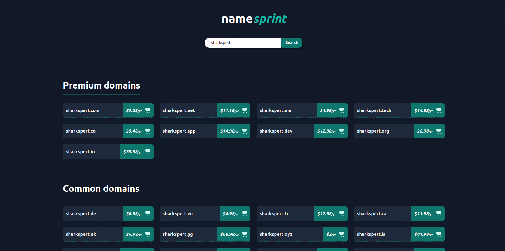

# namesprint

A web app which generates domain name suggestions, and then checks availability across hundreds of TLDs instantly.




# Setting up for Development

1. Clone the repository:

```
git clone https://github.com/athomson0/namesprint
cd namesprint
```

2. Build and start the development environment:

```
make dev
```

3. Open your browser and visit [http://localhost:5173](http://localhost:5173).


# Built with

* Vite
* ReactJS
* Flask
* Nginx
* Docker and docker-compose
* Ansible for deploying
* Prometheus + Grafana for monitoring